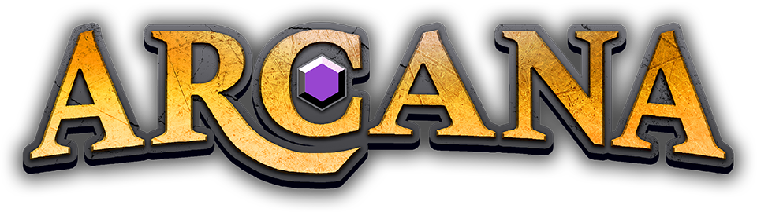

<div align="center">



**덱 빌딩 × TRPG × Co-op 웹 브라우저 게임**

[](https://threejs.org)
[](https://react.dev)
[](https://vitejs.dev)
[](https://vercel.com)

</div>

---

## 🔗 라이브 데모

> 배포 후 링크를 여기에 추가해주세요.

---

## 🐉 게임 소개

어둠이 왕국을 삼키기 전에, 모험은 시작되어야 한다.

**ARCANA**는 1~4인이 함께 플레이하는 Co-op 웹 브라우저 게임입니다.  
레드 드래곤이 매 턴 왕국을 향해 한 걸음씩 다가오는 동안, 플레이어들은 장비에서 자동으로 구성되는 카드 덱을 활용해 전투를 치르고, 퀘스트를 완수하고, 던전을 탐험하며 드래곤을 막아야 합니다.

| 항목 | 내용 |
|---|---|
| **장르** | Deck Building + TRPG + Co-op |
| **플랫폼** | 웹 브라우저 |
| **인원** | 1 ~ 4인 Co-op |
| **목표** | 4단계 퀘스트 완수 후 레드 드래곤 처치 |
| **게임오버** | 전원 사망, 또는 드래곤이 왕국 성에 도달 |

---

## 🎮 게임 흐름 — 한 판의 여정

### 1. 로비 — 파티 결성

브라우저를 열면 황금빛 글자와 어두운 배경의 타이틀 화면이 맞이합니다.  
닉네임을 입력하고 **새로운 모험 만들기**를 누르면 6자리 초대 코드가 생성됩니다.  
친구에게 코드를 공유하면 최대 4명까지 같은 로비에 참가할 수 있습니다.

로비에서는 **파이터 / 위자드 / 클레릭 / 로그 / 바드** 중 직업을 선택하고,  
6포인트를 원하는 스탯에 배분해 나만의 캐릭터를 완성합니다.  
모든 파티원이 확정 버튼을 누르면 게임이 시작됩니다.

---

### 2. 월드맵 — 왕국을 누비다

게임이 시작되면 카메라가 하늘 위에서 왕국 성 위로 천천히 내려앉습니다.  
**60×60 헥스 타일로 이루어진 섬**이 펼쳐지며, 타일마다 색이 다릅니다.  
초록빛 평원, 흰 설원, 불그스름한 화산지대, 짙은 숲이 Voronoi 경계로 자연스럽게 맞닿아 있습니다.

파티는 한 턴에 한 타일씩 이동합니다.  
타일을 클릭하면 파란 구슬 모양의 파티 마커가 부드럽게 굴러가고,  
카메라가 마커를 따라 함께 이동합니다.

마우스 우클릭으로 지도를 끌어 볼 수 있고, 휠로 줌인·줌아웃이 가능합니다.  
카메라를 직접 조작하는 순간 자동 추적이 해제되어 자유롭게 지도를 탐색할 수 있습니다.

**매 월드 턴이 끝나면**, 드래곤이 성을 향해 한 칸 이동합니다.  
이때 카메라가 드래곤의 위치로 이동해 그 모습을 비추고, 잠시 후 파티에게 돌아옵니다.  
드래곤이 마을 타일을 밟으면 그 마을은 불타오르고, 해당 타일에 있던 플레이어는 강제로 대피합니다.

---

### 3. 전투 — 카드와 전략

**적 타일**을 밟으면 전투가 시작됩니다.  
화면이 전장으로 전환되면서 카메라가 전장 전체를 위에서 내려다보다가,  
부드럽게 아군 뒤쪽으로 내려앉아 3인칭 시점이 됩니다.

화면 하단에는 현재 내 턴에 사용할 수 있는 카드들이 부채꼴로 펼쳐집니다.  
**AP(행동력)** 이 허용하는 만큼 카드를 사용할 수 있습니다.

- **공격 카드**를 적에게 드래그하거나 클릭해 사용하면 데미지가 들어갑니다.
- **방어 카드**로 배리어를 올리거나 포지션을 바꿔 다음 공격을 대비합니다.
- 적이 공격할 때는 카메라가 살짝 흔들려 타격감을 전달합니다.

전투 도중 **장비를 교체**하면 덱이 즉시 바뀌어 새로운 카드들이 손으로 들어옵니다.  
DEX 스탯이 낮아 먼저 맞는 상황이라면 **도망**을 시도할 수도 있습니다.

전투에서 승리하면 경험치와 골드를 획득하고 월드맵으로 돌아옵니다.

---

### 4. 던전 — 어둠 속의 노드

**던전 타일**에 발을 들이면 그 자리에서 시점이 바뀝니다.  
전투와 같은 3인칭 시점으로 매끄럽게 이어지며, 눈앞에 어둠 속에 떠 있는  
여러 개의 발판과 그 사이를 잇는 통로가 보입니다.

현재 내 발판과 바로 옆에 연결된 발판들만 빛 속에 드러납니다.  
멀리 있는 발판들은 안개 속에 가려져 있어 탐험의 긴장감을 유지합니다.

발판을 클릭하면 캐릭터 마커가 통로를 따라 이동하고,  
카메라가 뒤를 따라가다가 목표 발판 앞에 부드럽게 멈춥니다.

발판마다 다른 이벤트가 기다립니다.

| 발판 종류 | 내용 |
|---|---|
| ⚔️ 전투 | 던전 내 몬스터와 전투 |
| 💰 보물 | 골드와 경험치 획득 |
| 🪤 함정 | 민첩(DEX)으로 회피 판정 — 실패 시 데미지 |
| 🛒 상점 | 아이템 구매 |
| 📖 이벤트 | 야영지(회복), 고대 비문(임시 버프) 등 |
| 💀 보스 | 강화된 몬스터 |
| ✨ 코어 | 던전의 핵심 — 행운(LUK)으로 공략 판정 |

**코어를 클리어**하면 카메라가 멀리 줌아웃하며 던전 전체를 내려다보다가,  
파티가 다시 빛 속으로 나오며 월드맵으로 복귀합니다.

---

### 5. 퀘스트와 드래곤 결전

왕국 곳곳의 퀘스트 타일을 밟아 4단계 메인 퀘스트를 진행합니다.  
퀘스트 진행도가 높아질수록 드래곤과의 결전에서 난이도가 낮아집니다.

드래곤 타일에 발을 들이면 **레드 드래곤 보스전**이 시작됩니다.  
카메라가 먼저 보스의 정면으로 다가가 위압감을 전달한 후,  
아군 뒤에서 전투를 치르는 시점으로 전환됩니다.

드래곤은 3페이즈로 변화하며 점점 강해집니다.  
파티가 드래곤을 처치하면 **게임 클리어**입니다.

---

## 🛠 기술 스택

| 영역 | 기술 |
|---|---|
| **프론트엔드** | React 18 + Vite 5 |
| **3D 렌더링** | Three.js r128 (WebGL) |
| **상태 관리** | Zustand 4 |
| **네트워크** | PeerJS (WebRTC P2P) |
| **서버리스** | Vercel Serverless Functions |
| **폰트** | Cinzel / Cinzel Decorative / EB Garamond |

---

## 🏗 아키텍처

### 렌더링 구조

```
┌─────────────────────────────────────────────────────┐
│  React DOM Layer  — 카드 핸드, HP바, 모달, 결과 화면  │
├─────────────────────────────────────────────────────┤
│  Three.js Canvas  — 월드맵, 전투, 던전 3D 씬         │
└─────────────────────────────────────────────────────┘
```

두 레이어는 완전히 분리됩니다. Three.js 캔버스 위에 React가 투명하게 덮이며,
각자의 영역에서 독립적으로 동작합니다.

### 씬 전환 흐름

```
MAIN_MENU → LOBBY → WORLD_MAP
                        ↓  ↑
                    BATTLE / DUNGEON
                        ↓
                     RESULT
```

### 상태 관리 (Zustand 3-store)

```
gameStore   — 게임 진행 상태, 월드 턴, 드래곤 위치, 퀘스트 진행도
playerStore — 캐릭터 스탯, 덱/핸드/인벤토리, EXP/골드
uiStore     — 현재 씬, 모달, 로비 플레이어 목록, 카메라 연출 상태
```

### 네트워크 구조 (WebRTC P2P)

```
호스트 ─────────────────────── 클라이언트
  │  PeerJS WebRTC DataChannel   │
  │  시그널링: Vercel /api/signal  │
  │                              │
  ├─ 매 턴 종료 시 전체 상태 전송 →│
  ├─ 카드 사용 / 이동 요청       ←│
  └─ 호스트 연결 끊김 시          │
     가장 먼저 참가한 플레이어가   │
     자동으로 호스트 역할 인계     │
```

### 카메라 시스템

모든 씬이 공유하는 단일 카메라 제어 모듈(`CameraRig`)을 통해  
씬 전환 시에도 일관된 카메라 연출이 이어집니다.

| 씬 | 시점 | 주요 연출 |
|---|---|---|
| 월드맵 | 위에서 비스듬히 내려다보는 아이소메트릭 | 진입 시 하늘에서 내려앉기, 파티 마커 따라가기, 드래곤 이동 컷씬 |
| 전투 | 아군 등 뒤 3인칭 | 진입 시 전장 조감 후 뒤로 안착, 행동 캐릭터마다 카메라 이동, 피격 흔들림 |
| 던전 | 전투와 동일한 3인칭 | 노드 이동 시 따라가다 도착지 앞에 멈추기, 코어 클리어 줌아웃 |

### 프로젝트 구조

```
arcana-vercel/
├── api/signal.js              # WebRTC 시그널 릴레이 (Vercel Serverless)
├── public/assets/             # 타이틀 이미지, 파비콘
├── src/
│   ├── engine/
│   │   ├── CameraRig.js       # 공용 카메라 제어 모듈
│   │   ├── SceneManager.js    # 씬 관리 + 렌더 루프
│   │   ├── AssetManager.js    # 3D 메시 생성 (Three.js 프리미티브)
│   │   └── scenes/            # WorldMapScene, BattleScene, DungeonScene
│   ├── game/
│   │   ├── battle/            # 전투 엔진, AI, 카드 효과, 이니셔티브
│   │   ├── deck/              # 덱 빌더, 패시브 관리
│   │   ├── world/             # 월드 생성기, 헥스 그리드, 드래곤 AI
│   │   └── data/              # 카드, 아이템, 적, 퀘스트 데이터
│   ├── network/               # PeerManager, HostManager, SyncManager
│   ├── stores/                # gameStore, playerStore, uiStore
│   └── ui/
│       ├── theme.js           # 디자인 토큰 (색상, 폰트, 모서리 스타일)
│       ├── common/            # 모달, 상점, 캐릭터 정보, 퀘스트 UI
│       ├── hud/               # HP바, 카드 핸드, 월드 HUD, 인벤토리
│       └── screens/           # 메인메뉴, 로비, 캐릭터 선택, 결과 화면
├── index.html
├── package.json
└── vite.config.js
```

---

## 🚀 로컬 실행

```bash
npm install
npm run dev      # http://localhost:5173
npm run build    # 프로덕션 빌드
```

---

<div align="center">
<sub>ARCANA — Deck Building Co-op · Three.js + React + Vercel</sub>
</div>
